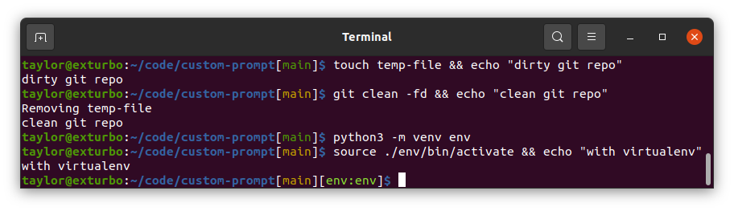

# Custom Prompt

A PS1 prompt generator using golang templates. This comes packaged with several default prompts that can be easily customized using the golang templates. Completely new prompts can also be built using the template format. The templates have certain data injected in them to be leveraged to display useful information in the PS1 prompt such as the git branch and python environment. 

## Predefined template examples:

### Ubuntu-Style

(See the template files for references [ubunutu](./prompts/ubuntu/))

Classic ubuntu style with git branch and python environment added:



### Kali-Style

(See the template files for references [kali](./prompts/kali/))

Multi-line kali inspired prompt with git branch and python environment added:


## Installation

Download the deb file located in the github release

Install the deb 
```bash
sudo apt install ./path/to/deb/custom-prompt_{version}_{arch}.deb
```

Add environment configuration to the ~/.bashrc
```bash
# Add to ~/.bashrc
VIRTUAL_ENV_DISABLE_PROMPT=1
PROMPT_COMMAND='PS1=$(custom-prompt)'
# Re-source bash (run in terminal)
source ~/.bashrc
```

Or run these in the terminal

```bash
echo '# Custom Prompt PS1' >> ~/.bashrc
echo 'VIRTUAL_ENV_DISABLE_PROMPT=1' >> ~/.bashrc
echo "PROMPT_COMMAND='PS1=\$(custom-prompt)'" >> ~/.bashrc
source ~/.bashrc
```

## Uninstall

```bash
sudo apt remove custom-prompt
```

Remove environment variables from ~/.bashrc
